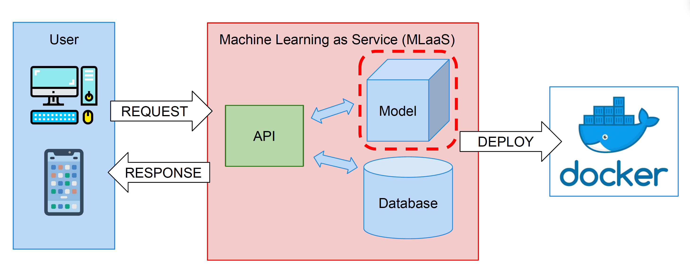
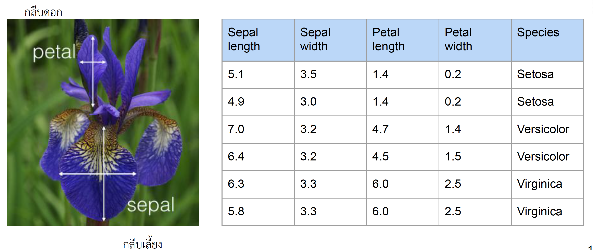
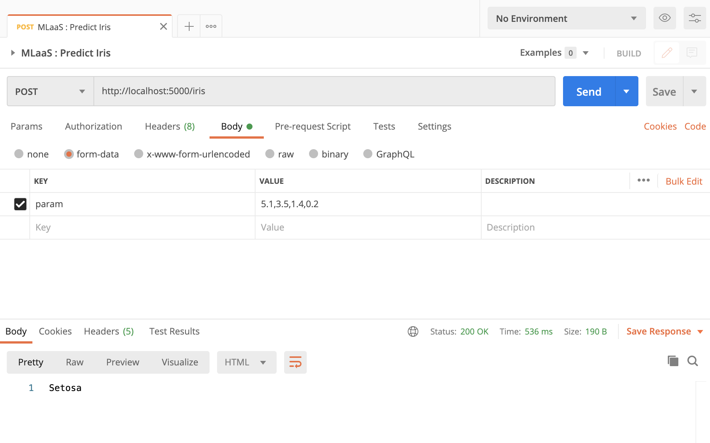
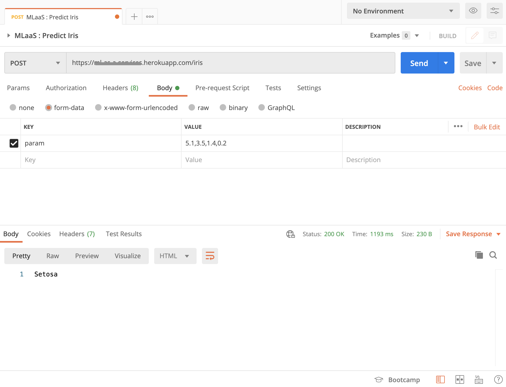

# Simple Machine Learning as a Service (MLaaS)

Let's predict `Iris` species from Iris's metrics!!!



## Iris's species


## Iris's metrics

 - Sepal length
 - Sepal width
 - Petal length
 - Petal width
 - Species

note : 

 - Sepal(กลีบเลี้ยง)
 - Petal(กลีบดอก)



## Installation

```bash
pip install -r requirements.txt
```

## Create Simple model to predict Iris

Load Iris data set from Sci-Kit learn datasets

Ref. [Jupyter notebook](create-model.ipynb)

```py
from sklearn.datasets import load_iris

iris = load_iris()
X, y = iris['data'], iris['target']
```

### Reshape data

```py
from sklearn.model_selection import train_test_split
import numpy as np

dataset = np.hstack((X, y.reshape(-1,1)))
np.random.shuffle(dataset)
X_train, X_test, y_train, y_test = train_test_split(dataset[:,:4],
                                                   dataset[:,4],
                                                   test_size=0.2)
```

### Train model

In this example, I using `LogisticRegression` model :

```py
from sklearn.linear_model import LogisticRegression

model = LogisticRegression()
model.fit(X_train, y_train)
y_pred = model.predict(X_test)
```

### Check accuracy

```py
from sklearn.metrics import accuracy_score

accuracy_score(y_test, y_pred)
```

### Save/Export the model

```py
import joblib

joblib.dump(model, 'iris.model')
```

## Simple Service with Flask

Example code :

```py
from flask import Flask, request
from flask_cors import CORS, cross_origin
import traceback
import sys
import joblib
import numpy as np
import os

app = Flask(__name__)
CORS(app)

model = None

@app.route('/iris', methods=['POST'])
@cross_origin()
def predict_species():
    req = request.values['param']
    inputs = np.array(req.split(','), dtype=np.float32).reshape(1,-1)
    predict_target = model.predict(inputs)
    if predict_target == 0:
        return 'Setosa'
    elif predict_target == 1:
        return 'Versicolour'
    else:
        return 'Virginica'

if __name__ == '__main__':
    try:
        # Load model
        model = joblib.load('iris.model')

        port = int(os.environ.get('PORT', 5000))
        app.run(host='0.0.0.0', port=port, debug=True)
    except Exception as ex:
        traceback.print_exc(file=sys.stdout)
```

## Iris's metrics for testing

| Sepal length | Sepal width | Petal length | Petal width |
|--------------|-------------|--------------|-------------|
|   5.1        |     3.5     |     1.4      |     0.2     |

It should predict to `Setosa`.

Example the request:



## Deploy the container to Heroku

Don't see it(the service) alone, let's deploy it to public cloud!!!

### Install Heroku CLI

Please refer to https://devcenter.heroku.com/articles/heroku-cli

### Deployment

In the root of the project directory :

```bash
$ heroku container:login
# Login Succeeded

$ heroku create YOUR_SERVICE_NAME
# Creating ⬢ YOUR_SERVICE_NAME... done
# https://YOUR_SERVICE_NAME.herokuapp.com/ | https://git.heroku.com/YOUR_SERVICE_NAME.git

$ heroku container:push web --app YOUR_SERVICE_NAME
# === Building web (/YOUR_DIRECTORY/Dockerfile)
# Sending build context to Docker daemon  4.793MB
# Step 1/7 : FROM python:3.7-slim-buster
# ...
# latest: digest: sha256:c7548c...............................788c01 size: 2001
# Your image has been successfully pushed. You can now release it with the 'container:release' command.

$ heroku container:release web --app YOUR_SERVICE_NAME
# Releasing images web to YOUR_SERVICE_NAME... done
```

Check service status :

```bash
$ heroku logs --app YOUR_SERVICE_NAME
# CURRENT_DATE_TIME app[api]: Initial release by user YOUR@mail.com
# CURRENT_DATE_TIME app[api]: Release v1 created by user YOUR@mail.com
# ...
# CURRENT_DATE_TIME app[web.1]: * Environment: production
# CURRENT_DATE_TIME app[web.1]: WARNING: This is a development server. Do not use it in a production deployment.
# CURRENT_DATE_TIME app[web.1]: Use a production WSGI server instead.
# CURRENT_DATE_TIME app[web.1]: * Debug mode: on
# CURRENT_DATE_TIME app[web.1]: * Running on http://0.0.0.0:13879/ (Press CTRL+C to quit)
# CURRENT_DATE_TIME app[web.1]: * Restarting with stat
# CURRENT_DATE_TIME app[web.1]: * Debugger is active!
# CURRENT_DATE_TIME app[web.1]: * Debugger PIN: 281-003-968
# CURRENT_DATE_TIME heroku[web.1]: State changed from starting to up
```



## License

MIT